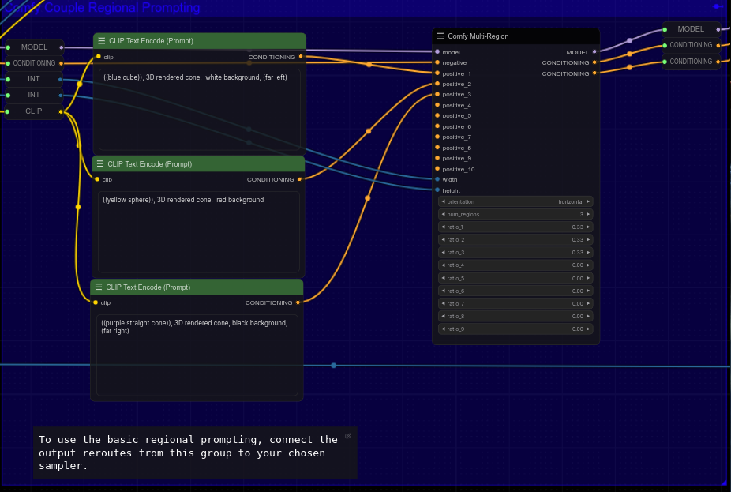

# Comfy EnhancedMultiRegion

## What this node does: 

This is simple custom node for [**ComfyUI**](https://github.com/comfyanonymous/ComfyUI) which helps to generate images with _regional prompting_ way easier.

If you want to draw different regions together without blending their features, check out this custom node.

| ⭕ with ComfyEnhancedMultiRegion (I mistakenly kept "3D rendered cone" in all of the prompts XD)| ❌ without ComfyEnhancedMultiRegion |
| --- | --- |
|  |  |
| Prompt 1: ((blue cube)), 3D rendered cone,  white background, (far left)
Prompt 2: ((yellow sphere)), 3D rendered cone,  red background 
Prompt 3: ((purple straight cone)), 3D rendered cone, black background, (far right) | _Single Prompt_: ((blue cube)), 3D rendered cone,  white background, (far left), ((yellow sphere)), 3D rendered cone,  red background, ((purple straight cone)), 3D rendered cone, black background, (far right) |

This is a fork of [**Danand/ComfyUI-ComfyCouple**](https://github.com/Danand/ComfyUI-ComfyCouple), implementing FP16 support and upto 10 different regions in a single image.

## Installation

1. Change directory to custom nodes of **ComfyUI**:

   ```bash
   cd ~/ComfyUI/custom_nodes
   ```

2. Clone this repo here:

   ```bash
   git clone https://github.com/neeltheninja/ComfyUI-ComfyEnhancedMultiRegion.git
   ```

3. Restart **ComfyUI**.

## Usage

1. Right click in workflow.
2. Choose node: **loaders → ComfyEnhancedMultiRegion**
3. Connect inputs (as many positive conditionings as you need), a single negative conditioning, and the clips. Convert the width and height Widgets to Inputs and feed the image latent size to the node. (Refer to my workflow).
4. Connect outputs

Example workflow is [here](workflows/MultiRegionalWorkflow.json).


## Credits

- [**@laksjdjf**](https://github.com/laksjdjf) – [Attention-Couple](https://github.com/laksjdjf/attention-couple-ComfyUI) and [Comfy-Couple](https://github.com/Danand/ComfyUI-ComfyCouple).
